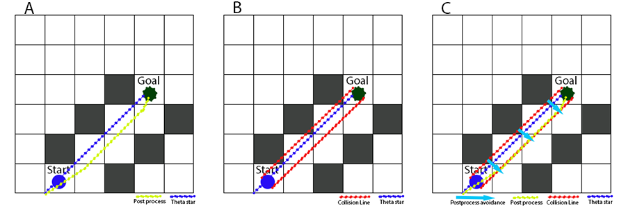

# Age of Heros

Age of Heroes is an RTS game made in Unreal Engine using C++. The game is high-performance and easy to extend. You can find the explanation of each part in the [Code Exploration](#code-exploration). 
I will document more of the codebase as I add new features.
you can find me here: </br>
<ul>
 <li><a href="https://www.linkedin.com/in/mrhaloka/" rel="nofollow noreferrer">
     
           Linkedin 
  </a></li>
 <li><a href="mailto:MrHalokaGD@gmail.com" rel="nofollow noreferrer">
     
           Email
  </a></li>
</ul>
If you find this repository interesting, please consider giving it a ⭐️.  Your support means a lot and helps others discover it too. Thank you!

___

## Introduction

<p>I started this project to deepen my understanding of C++ and game programming while also expanding my portfolio, inspired by my passion for Age of Empires II. My ultimate goal is to create a multiplayer 1v1 game featuring AOE2 community heroes such as Viper, Hera, Daut, T90, and more. While there's still a long way to go to complete this project, I'm excited about the journey ahead.</p>
<p>Throughout the project, I aimed to maintain high performance and readability. If you encounter any problems or notice any missing features, feel free to contact me or create a new issue.</p>

___

## Code Exploration
In each section, I first explain the problem and then the solution I chose for it and why.
In the subsections, I dive more deeply into how things work under the hood.

>[!NOTE]
>This list will grow as I add new features to the project and find more time to document the existing ones.

### [Object Manager](#object-manager)
- [Spatial Hash](#spatial-hash)
  - [Indexer](#indexer)
  - [Iterators](#iterators)

### [Pathfinding](#pathfinding)
- [Theta Star](#theta-star)
- [Ray Casting](#ray-casting)
- [Post Process](#post-process)
- [Steering](#steering)
  
### [Perception System](#perception-system)
- [Sight Component](#sight-component)
  
### [Combat System](#combat-system)
- [Melee Attack](#melee-attack)
- [Range Attack](#range-attack)
  - [Projectiles](#projectiles)


### Object Manager
```cpp
#include "Managers/ObjectsManager.h"
```
<p>One of the most important parts of any RTS game is being able to handle units based on their location. Whenever a player tries to select a unit, units collide with each other, or even finding a path.</p>

>[!TIP] 
> There are a few other ways you can solve this problem, but using spatial hash is one of the most optimized and easiest for games like this.

<p>Objects Manager is a class that, each time a match starts, the game mode creates an object from to store our actor data.</br>
Its primary function is to allow constant-time retrieval of actors based on their locations or grid positions, eliminating the need to loop through all actors.</br>
it creates a <code>FSpatialHash2d</code> based on its grid and cell size. Every time a unit spawns, it assigns that unit an ID and adds it to the HashGrid. It updates if a unit moves.</p>
<p> Methods like:
<ul>
  <li><code>GetUnitInLocation</code> (to find a unit in a location)</li>
  <li><code>IsBlock</code> (to check if a grid is blocked by static objects like buildings)</li>
  <li><code>AdjacentNeighbours</code> (to get all the units in all the adjacent neighbors)</li>
</ul></p>

<p>are some of the functions you can find inside <code>Managers/ObjectsManager</code>.</p>

-  #### Spatial Hash
```cpp
#include "Containers/SpatialHash2d.h"
```
 > <p>A spatial hash is a data structure used to efficiently manage objects based on their positions within a virtual space. It divides the space into a grid of cells, allowing for quick retrieval of objects located in a particular region. Each object is assigned to one or more cells based on its position. This enables fast queries such as finding objects within a certain area or checking for collisions between nearby objects. Spatial hashes are particularly useful in real-time strategy (RTS) games where units often interact based on their proximity in the game world.</p>

<p><code>SpatialHash2d</code> is the class that we use to store our units inside a spatial hash. It initially creates its own <code>TMultiMap</code> to store units base on thier location and <code>GridIndexer2d</code> to create an index for those locations. this class is fully commented on what each function does. <br>
 you should be able to find it in <code>Containers/SpatialHash2d</code>.</p>
 
- ##### Indexer
```cpp
#include "DataStructures/GridIndexer2d.h"
```
<p><code>GridIndexer2d</code> has the role of assigning an ID to each location based on the grid they're on. It starts from the left bottom corner as 0 and the right top corner as the maximum ID value. From there, it adds 1 each time it moves to the next right grid neighbor.When each row ends, it moves to the upper row and continues adding IDs until it reaches the last grid on the top right.(see Figure 1)</p> 
<p>whenever <code>SpatialHash2d</code> needs to access a point(units) on grid, it calls the indexer's <code>ToGrid</code> function.
This function takes an <code>FVector2D</code> location as its input and returns the ID that represents its grid in the hash map.</p>

  
<p><ins> <b>Figure 1</b> </br></ins>
 <sub>Indexer ids for a 3x3 grid</sub></p>
 
- ##### Iterators
```cpp
#include "Iterators/SpatialHashIterator.h"
```
  <p> There are occasions when need to iterat over collection of grids to access the data we need. a common example is when we're searching for units within a certain radius of a location. To make iterating over grids and debuggin easier, there's the <code>SpatialHashIterator</code> class that can handle 2 different types of iterations.</br>
<h6>The first type:</h6> when you have the query center and you want to iterate over all grids that are within a radius.</br>
 <code>FSpatialHashIterator(const FGridIndexer2d& Indexer, const FVector2d& QueryPoint, float Radius)</code>
</br>
<h6>The second type:</h6> when you have min and max locations that you want to iterate through. (A simple example of this behavior is when a player drag selects in an RTS game.)</br>
 <code>FSpatialHashIterator(const FGridIndexer2d& Indexer, const FVector2d& MinPoint, const FVector2d& MaxPoint)</code></p>
 
>[!TIP] 
> <p>Both of these methods have an <code>Iterate()</code> and <code>IsFinish()</code> method. Every time you iterate, it will provide you with an ID for the current grid.</p>
### Pathfinding

 >One of the central problems in game AI is finding short and realistic-looking paths. 
Pathfinding is typically divided into two steps: discretize and search. First, the discretize
step simplifies a continuous environment into a graph. Second, the search step propagates 
information along this graph to find a path from a given start vertex to a given goal vertex. 
Video game developers (and roboticists) have developed several methods for discretizing continuous environments into graphs, such as 2D regular grids composed of squares 
(square grids), hexagons or triangles, 3D regular grids composed of cubes, visibility 
graphs, circle-based waypoint graphs, space-filling volumes, navigation meshes, framed 
quad trees, probabilistic road maps, and rapidly exploring random trees [Björnsson 03, 
Choset 04, Tozour 04].
  <p> Now that we have our objects manager ready the next important part is pathfinding. in our game we have a grid-based world ready. new static object (such as building and resources) can spawn or get destroy during game, meaning our enviorment is fully dynamic.
    the initial solution to our problem is using A* pathfinding and use our grids as graph nodes. However, the primary limitation of A* is that each path's parent is always one of its neighbors, meaning our units can only move left-right or up-down resulting the 
    suboptimal and robotic path.(see Figure 2)
    that's why instead of using A* we're using theta* that builds upon the basic principles of A* and make anyangle-pathing possible. (see Figure 2)
  </p>
  
   
  <p><ins> <b>Figure 2</b> </br></ins>
 <sub>Showcasing theta-star pathfinding compare to A-star.</sub></p>
 
 - #### Theta star
```cpp
#include "Pathing/ThetaStar.h"
```
   <p>the most important reason of using theta* is ani-angle pathing. thet* adds an extra condition to what A* has and that's checking for line of sight. Two nodes have line of sight if a line can be drawn between them without encountering any obstacle.</p>

>[!TIP]
> Theta* properties : </br>
> G: cost of moving from the start node to this node </br>
> 𝐻: cost of moving from this node to goal (distance from current node to end node)</br>
> F: is the total cost of this node. (G + H)

<p> Like A* we have 2 sets of list (Opens and Closes) and a <code>priority_queue</code> of open ids to efficiently search throgh nodes. Open ids are sorted based on their F values.</p>
<p>When an object created from <code>Pathing/ThetaStar</code> class. it first set the objects manager that it works with then create a line of sight component (explained in Ray casting) that it use for visibility checks. Next,
it calculate the F value for the starting point (where the unit currently is) and push it to the open ids.</p>
<p>then in <code>CalculateThePath()</code> method it get the lowest score from priority_queue and obtains its neighbours, calculate thire G, and adds them to open ids.</p>
<p>in <code> CalculateAndUpdateG() </code> we calculate the G with 2 diffrent path:
<ul>
<li> the first one (A*) computes the distance from its parent plus its parent's G value</li>
<li>In the second path, it checks if the current node has line of sight to its grandparent. If it does, then it calculates the distance from the current node to its grandparent plus the grandparent's G value.</li>
</ul>
</p>
<p> To make working with nodes easier there's a <bold> FThetaVertex </bold> data structre that has all the necessaris data in it:</p>
     <code>FVector2d GridLocation;</code></br>
    	<code>double G;</code></br>
	    <code>double H;</code></br>
	    <code>uint32 Parent;</code></br>
	    <code>uint32 GridId;</code></br>


 - #### Ray casting
```cpp
#include "Components/LineOfSightComponent.h"
```
<p>To make theta* work, we need a way to check visibility line between 2 points.Since our blocking objects (resources like trees or buildings like houses) are grid-based, meaning they block a full grid, all we need to do is determine which grids lie between our two points. If there's no blocking point in any of those grids, we can draw a visibility line without any issues.</p>
<p> To find all those grids, we use Bresenham's line algorithm. This makes our ray casting much faster as we only check the grids that are part of the line.(see Figure 3)
<p>For performing any raycast, you can easily use the <code>FLineOfSightComponent</code>, which takes an <code>FObjectsManager</code> to check for blocking grids</p>

>[!TIP]
>You can use <code>HasLineOfSight()</code> method to check if 2 points has visible line to each other
>or use <code>GetBlockingObjects()</code> to get all the blocking objects in between.

  
<p><ins> <b>Figure 3</b> </br></ins>
 <sub>Grids that are checked to see if this visibility line is blocked by any static object.</sub></p>
 

 - #### Post process

```cpp
#include "Pathing/ThetaStar.h"
```
<p>Now that we have the path, we need to consider our unit's collision radius. In Figure 4-A, you can see how the post-process attempts to adjust the path within the grid to prevent collisions between moving and static objects.</p>
<p>After Theta* finds the path, it calls the <code>PostProcess()</code> method. This method draws two extra lines from the right and left collision sides of the unit and checks for any blocking objects. Whenever it finds one, it saves those objects in a list. (Figure 4-B)</p>
<p>Later, it calls <code>ChangePathForCollisionSize()</code> with the locations of the blocking objects. This function tries to find the closest corner of the blocking objects to the path and pushes the path away from the center of the blocking object to prevent collisions. (Figure A-C)</p>


  <p><ins> <b>Figure 4</b> </br></ins>
<sub>A) Theta-star finding the path, and PostProcess making it collision-free for the unit. B) Two collision lines on both the left and right sides (red) of the Theta-star path to detect any collisions within the current path. C) PostProcess pushing the Theta-star path away from blocking points.</sub>


 - #### Steering

```cpp
#include "Components/Movement/SteeringComponent.h"
```
>Steering behaviors are algorithms used to calculate the desired direction and speed for a unit to move towards a target or avoid obstacles. These behaviors can be combined to create complex and realistic movement patterns.

<p>Pathfinding can now calculate a path that is optimal for our unit and avoids any static objects. But what about moving units? This is where we start using steering forces.</p>
<ul>
 	<li>Seek: This behavior calculates the velocity needed for a unit to reach a goal position..</li>
	<li>This behavior checks for nearby units. If another unit is detected, it calculates the time to collision (TTC). If the TTC is within the collision range, it adjusts the velocity to ensure the unit avoids the other unit.</li>
</ul>

>[!NOTE]
>This list will grow as more steering types are added.

<p> Let's discuss how steering velocities work in Age of Heroes. After <code>AMoveableUnit</code> gets the path from theta*, it calls seek on each tick to move toward the first goal.  When the unit reaches this target, it updates to the next goal and repeats the process.</p><p> in <code>Seek()</code> method it first calculate the goal direction from current unit position and then multiplies it by the unit speed.</p>
</p>

<p>After <code>Seek()</code> calculated the goal velocit, moveable, calls the <code> Avoidance()</code> method. this method, at first get all the other moveables in a radius and then calculate the TTC.</p>

>[!TIP]
> TTC equation is based on (unit postion + unit velocity * TTC ) - (obstacle  postion + obstacle velocity * TTC ) = unit collision radius + obstacle collision radius </br>
> Check <code>TimeToCollision()</code> method inside steering component for more information.

<p> If a collision is imminent, it will call the avoidance with obstacle data and TTC(Time to Collision). This method then calculates the necessary velocity needed to keep the objects out of each other's way.</p>
<p> The smaller the TTC becomes, the higher the avoidance force weight gets. This weight creates more realistic behavior for units, as the closer they are to each other, the more they deviate from their path to avoid collisions.</p>
<p> There's still another problem that need to be solved. If a unit changes its direction at the last second, it can block the other unit since TTC is 0 and a collision has already happened. to fix this probelm, <code>Avoidance()</code> calls <code>TurnoffMovingCollisionTemporary()</code> to change the unit collision radius to 1. this allows both units to move around each other without a problem of getting stuck.</p>

### Perception system

```cpp
#include "Managers/PerceptionManager.h"
```

<p>Perception manager is responsible for adding sight to units, allowing them intract with the world around them. it gives units ability to sense their surroundings and other units. 
Perception Manager is a class that sits on top of the Objects Manager. In an RTS game, where there can be many units, the performance of the perception system is crucial. This system is designed to detect units only when they change states. If all units in the game remain idle and nothing changes, the perception system imposes no overhead on the CPU.</p>
<p>Perception manager has its own hash grid that used to attach grids to units. whenever a units spawn in the world and has <code>SightComponent</code>, the perception manager marks all the grids that are within its perception radius with that unit id. if any unit moves or spawns inside those marked grid, perception manager will brodcast the event to let the <code>SightComponent</code> know that a unit has been sensed.</p>

- #### Sight component

```cpp
  #include "Components/AI/SightComponent.h"
```
<p>The Sight Component allows a unit to communicate with the Perception Manager. Upon adding this component to any unit, it automatically registers its owner with the perception system. If any component or its owner needs to use the perception system later on, they can utilize the built-in event <code>OnSenseUnitEvent</code> and add their listener to the perception system.</p>

### Combat system

```cpp
#include "Components/Combat/BaseCombatComponent.h"
```

<p>In an RTS game, the combat system consists of different phases. First, it needs to find a target, which can happen automatically when units are on patrol and sense an enemy or when a player clicks a new target to attack. Then, if the unit is mobile, it should chase its target and stay in range to be able to attack it (e.g., scouts, archers). If the unit is stationary, it should try to attack as long as the enemy is in range (e.g., towers).</p>
<p>The <code>BaseCombatComponent</code> includes configurable variables such as MaxRange, MaxPursuitRange, ReloadTime, Cooldown, Damage, and AttackLength. Its functionalities are designed to be easily configurable for different types of attacks (such as ranged or melee). To add the ability to fight, you simply add this component to any unit type you want. It attempts to register itself with the <code>SightComponent</code>, if possible, and listens for its owner's state changes.</p>

>[!TIP]
>The base component is fully commented. I have explained each function and how you can create new attack types as thoroughly as possible.

- #### Melee attack
  
```cpp
 #include "Components/Combat/MeleeAttackComponent.h"
```
<p>Melee range is the simplest type that can be create using the <code>BaseCombatComponent.</code> As the base component already has all the necessary functionalities, you just need to set the appropriate variables.</p>

- #### Range Attack

```cpp
 #include "Components/Combat/RangeAttackComponent.h"
```
<p>For the range attack component, a few changes need to be made. The first change is in how <code>PerformAttack()</code> works. Instead of dealing damage directly, it needs to spawn a projectile and shoot at the target. I will explain how projectiles work in the next part. As archers need to stay still to shoot, they have an extra method <code>AttackCompleted()</code> that gets called after their attacking animation finishes.</p>
<p>The Range Attack Component includes a property named <code>ProjectileType</code> that allows you to specify the type of projectile this component uses to attack.</p>
<p>Reading this class is a good way to undrestand how making custome attack type works.</p>

- ##### Projectiles

```cpp
#include "Actors/Projectils/BaseProjectile.h"
```
<p><code>BaseProjectile</code> has all the necessary methods for a projectile.<code>InitializeProjectile()</code> sets the location from which the projectile will start moving and sets the target. Then, it calculates the starting Z velocity to ensure the projectile hits the target.</p>

<p>The damage each projectile inflicts should be set before fully spawning the projectile, as arrows with different upgrades can do varying damage. However, other properties like speed and collision radius, which are consistent across all instances of the same projectile type, are loaded from the game mode (same variables across all objects).</p>

<p>To add a new type of projectile, you need to create a new blueprint from <code>BaseProjectile</code> or any of its children. You can add the static mesh of the projectile in the blueprint and need to add a new row to the Projectile.CSV file inside the data directory.</p>
  
___

## Showcases
### Pathfinding
  
### Resource harvesting and dropoff
  
### Range attack & projectiles (tower and archer)
  
### Melee attack & chasing
  
### Collision avoidance
  
